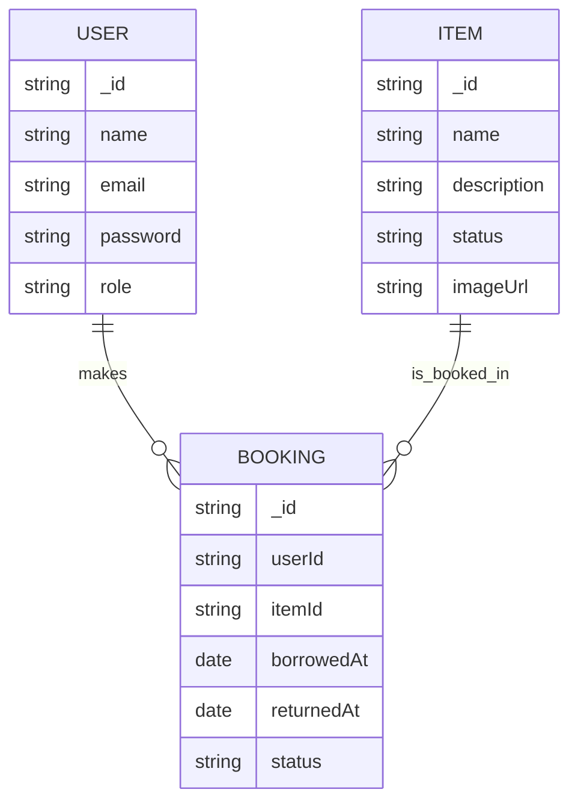

# School Equipment Lending Portal

## Overview

The **School Equipment Lending Portal** is a full-stack web application designed to help schools **manage, track, and borrow** equipment efficiently.  
Admins can manage inventory, staff can issue/return items, and students can request loans — all within a secure, responsive Neumorphic interface.

---


## Features

- **User Roles:** Admin, Staff, and Student
- **Equipment Management:** Add, edit, and delete school items
- **Booking System:** Borrow and return items with approval tracking
- **Authentication & Authorization:** Secure JWT-based login/signup
- **API Documentation** via Swagger UI
- **Dashboard & History:** Manage items, monitor borrowing stats
- **AI Assistance:** Code generation and optimization using ChatGPT & GitHub Copilot
- **UI Design:** Elegant neumorphic interface for modern, accessible experience

---

## Getting Started  

### Prerequisites  
Ensure you have the following installed:  
- **Node.js** (v18+)  
- **MongoDB Atlas Account**  
- **npm** or **yarn**  
- (Optional) **Docker** if containerizing  

---

### Backend Setup  

```bash
# 1️⃣ Navigate to backend folder
cd backend

# 2️⃣ Install dependencies
npm install

# 3️⃣ Create .env file
MONGO_URI=<your_mongo_atlas_connection_string>
JWT_SECRET=<your_secret_key>
PORT=5000

# 4️⃣ Start the server
npm run dev

# 5️⃣ Visit Swagger docs
http://localhost:5000/api-docs

```
---

### Frontend Setup  

```bash

# 1️⃣ Navigate to frontend folder
cd frontend

# 2️⃣ Install dependencies
npm install

# 3️⃣ Run the React app
npm start

```
---

## Tech Stack

| Layer          | Technology                            |
| -------------- | ------------------------------------- |
| **Frontend**   | React + Tailwind CSS (Neumorphism UI) |
| **Backend**    | Node.js + Express.js                  |
| **Database**   | MongoDB Atlas                         |
| **Auth**       | JWT (JSON Web Tokens)                 |
| **API Docs**   | Swagger UI                            |
| **Deployment** | Docker (Local/Minikube-ready)         |

---

## System Architecture

### High-Level Design

[ React Frontend ]
↓
[ Express.js REST API ]
↓
[ MongoDB Atlas Database ]

All communication between frontend and backend happens via secure REST APIs, authenticated using JWT.

---

### Backend Architecture

backend/
├── server.js
├── swagger.js / swagger.yaml # API documentation
├── routes/
│ ├── authRoutes.js # Login, Signup, Logout
│ ├── itemRoutes.js # CRUD for items
│ └── bookingRoutes.js # Booking & return endpoints
├── controllers/
│ ├── authController.js # Handles authentication logic
│ ├── itemController.js # Manages item CRUD operations
│ └── bookingController.js # Booking workflow logic
├── models/
│ ├── User.js # User schema
│ ├── Item.js # Equipment schema
│ └── Booking.js # Booking schema
├── middlewares/
│ └── authMiddleware.js # JWT token verification
└── config/
└── db.js # MongoDB connection setup

---

### Frontend Component Hierarchy

frontend/
├── App.js
├── components/
│ ├── NavBar.jsx # Top navigation with logout + Swagger link
│ ├── UI/
│ │ ├── ConfirmModal.jsx
│ │ ├── ItemCard.jsx
│ │ └── NeumorphicButton.jsx
│ └── Context/
│ └── AuthContext.jsx # Provides global authentication state
├── pages/
│ ├── Home.jsx
│ ├── Login.jsx
│ ├── Signup.jsx
│ ├── ManageBookings.jsx
│ ├── AdminItems.jsx

---

## Database Schema (MongoDB)

### Entities

| Collection   | Fields                                                            | Description                       |
| ------------ | ----------------------------------------------------------------- | --------------------------------- |
| **users**    | `_id`, `name`, `email`, `password`, `role`                        | Stores login credentials and role |
| **items**    | `_id`, `name`, `category`, `description`, `quantity`, `available` | Equipment details                 |
| **bookings** | `_id`, `userId`, `itemId`, `borrowDate`, `returnDate`, `status`   | Tracks who borrowed which item    |

---

### ER Diagram


---

## Authentication Flow

1. User Signup/Login → /api/auth/signup & /api/auth/login
2. JWT Token Generated → Stored in localStorage
3. Protected Routes (backend) → authMiddleware.js verifies token
4. Role-Based Access → Admin can manage items, users can book

---

## API Documentation (Swagger)

Swagger UI available at:
👉 http://localhost:5000/api-docs

You can also add a Swagger button in the frontend Navbar for quick navigation:
```bash
<Button onClick={() => window.open("http://localhost:5000/api-docs", "_blank")}>
   Swagger Docs
</Button>
```

---

## Docker Setup

Build and run containers

```bash
docker-compose up --build
```
--- 


## Author
 
|  **Sarumathy G**  |  
|  **2024TM93153**  |  
|  **Developed as part of Full Stack Application Development (SE ZG503)** |
 
---